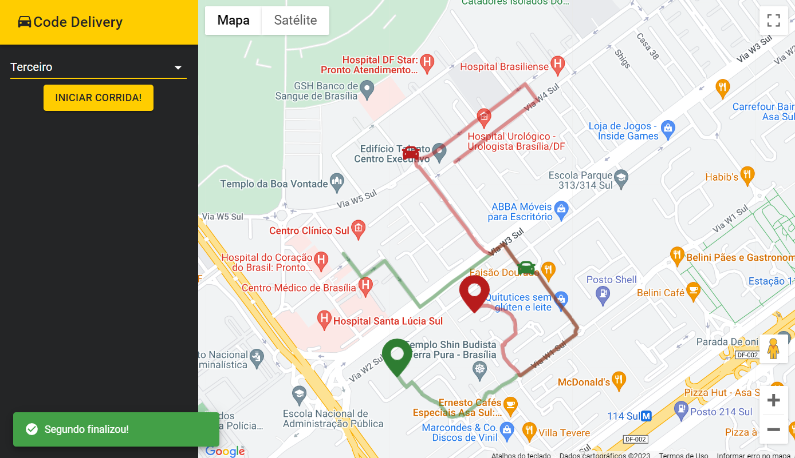

# Code Delivery



Projeto construido na Imersão Full Stack && Full Cycle

## Como usar?

Primeiro, vamos iniciar o container do kafka, elasticsearch, kibana e zookeeper

```bash
docker compose -f .docker/kafka/docker-compose.yaml up
```

Em seguida, vamos iniciar o simulador. (Sistema responsável por simular rotas)

```bash
docker compose -f simulator/docker-compose.yaml up

docker exec -it simulator-service bash

go run main.go
```

Agora, iniciaremos o backend, API em NestJS responsavél pela comunicação do Kafka com o FrontEnd usando WebSocket.

```bash
docker compose -f nest-api/nest-api/docker-compose.yaml up

```

Por fim, chegou a hora de iniciar o FrontEnd e ver a aplicação toda funcionando.

```bash
docker compose -f react-frontend/docker-compose.yaml up

```

## Tecnologias utilizadas:

- GO lang
- NestJS
- ReactJS
- Docker
- TypeScript
- Kafka
- ElasticSearch & Kibana
- Kubernetes
